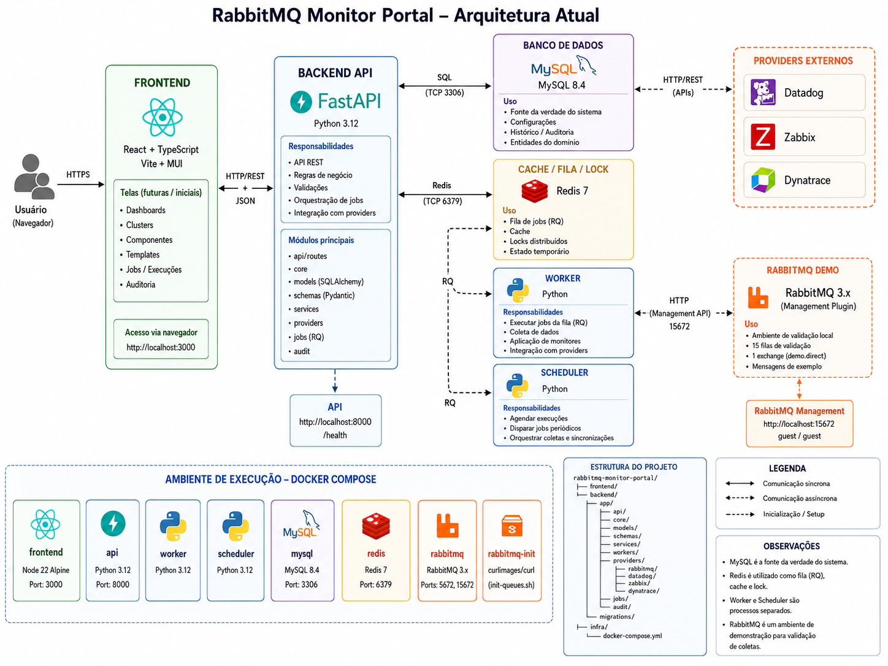

# RabbitMQ Monitor Portal

Portal web para gerenciamento de clusters RabbitMQ, discovery de filas e governança de templates de monitoramento para ferramentas de observabilidade.

A aplicação mantém o **MySQL como fonte da verdade** das configurações, componentes descobertos e templates aplicados. O Redis é usado para filas de processamento, cache e suporte aos workers.

## Arquitetura



## Stack

- **Frontend:** React + TypeScript + Vite + MUI
- **Backend:** Python + FastAPI
- **Worker:** Python + RQ
- **Banco de dados:** MySQL 8.4
- **Cache/Fila:** Redis 7
- **Diretório local para desenvolvimento:** OpenLDAP
- **RabbitMQ de demonstração:** RabbitMQ Management
- **Orquestração local:** Docker Compose

## Serviços do Docker Compose

| Serviço | Descrição | Porta local |
|---|---|---:|
| `frontend` | Interface web React/Vite | `3000` |
| `api` | API FastAPI | `8000` |
| `worker` | Worker RQ para jobs assíncronos | - |
| `scheduler` | Atualização periódica do cache de diretório | - |
| `mysql` | Banco MySQL 8.4 | `3306` |
| `redis` | Redis para cache/fila | `6379` |
| `ldap` | OpenLDAP local com usuários de exemplo | `389` |
| `rabbitmq` | RabbitMQ demo com Management | `5672`, `15672` |
| `rabbitmq-init` | Script de criação de filas demo | - |

## Pré-requisitos

- Docker
- Docker Compose
- Git

## Subir o ambiente local

```bash
cd infra
docker compose up --build
```

Acessos locais:

| Recurso | URL / acesso |
|---|---|
| Frontend | http://localhost:3000 |
| API | http://localhost:8000 |
| Documentação Swagger | http://localhost:8000/docs |
| RabbitMQ Management | http://localhost:15672 |
| RabbitMQ usuário | `guest` |
| RabbitMQ senha | `guest` |
| MySQL host local | `localhost:3306` |
| MySQL database | `rabbitmq_monitor_portal` |
| MySQL app user | `app` |
| MySQL app password | `app_password` |
| MySQL root password | `root_password` |

## Primeiro uso

Após subir os containers, acesse o frontend e siga este fluxo:

1. Acesse **Administração > Grupos SRE**.
2. Crie ou edite um grupo SRE.
3. Adicione pessoas ao grupo usando o autocomplete por e-mail.
4. Acesse **Administração > Datadog Orgs**.
5. Cadastre uma org Datadog com API URL, Org URL, API Key e APP Key.
6. Acesse **Clusters**.
7. Crie um cluster RabbitMQ.
8. O portal testa a conectividade com o RabbitMQ antes de salvar.
9. Após salvar, execute o discovery de queues.
10. Acesse **Queues** para visualizar, editar metadados, aplicar templates e customizar thresholds.

Para usar o RabbitMQ demo como cluster cadastrado no portal:

| Campo | Valor |
|---|---|
| Nome | `RabbitMQ Demo` |
| Ambiente | `dev` |
| DNS do cluster | `rabbitmq` |
| Protocolo | `http` |
| Porta da API | `15672` |
| Usuário | `guest` |
| Senha | `guest` |

## Banco de dados

O script inicial do banco está em:

```text
infra/mysql/init/001_schema.sql
```

Ele é executado automaticamente pelo container `mysql` apenas quando o volume do banco é criado pela primeira vez.

### Recriar banco do zero em ambiente local

> Este comando apaga os volumes locais do MySQL, Redis, RabbitMQ e LDAP.

```bash
cd infra
docker compose down -v
docker compose up --build
```

### Aplicar upgrade SQL em banco já existente

Caso já exista volume MySQL criado, os scripts em `infra/mysql/init` não serão executados novamente. Para aplicar o upgrade disponível:

```bash
cd infra
docker compose exec -T mysql mysql -uroot -proot_password rabbitmq_monitor_portal < mysql/upgrade/002_phase1_adjustments.sql
```

## Redis

Não é necessário criar nenhuma estrutura manual no Redis.

O Redis é usado para:

- fila de jobs RQ;
- cache de pessoas do diretório;
- controle auxiliar dos workers.

Principais chaves usadas:

```text
rq:queue:default
rq:job:<job_id>
rq:worker:<worker_id>
directory:people
directory:people:refreshed_at
```

## OpenLDAP local

O ambiente local possui um container OpenLDAP para simular um diretório corporativo.

Seed de pessoas:

```text
infra/ldap/bootstrap/50-people.ldif
```

O cache de pessoas é atualizado pelo `scheduler` e também pode ser atualizado manualmente via API:

```http
POST /directory/refresh-cache
```

Busca de pessoas para autocomplete:

```http
GET /directory/people?query=<email>&limit=5
```

A busca é case-insensitive e retorna até 5 resultados.

## RabbitMQ demo

O ambiente local inclui um RabbitMQ com Management Plugin.

O script abaixo cria filas de exemplo no RabbitMQ demo:

```text
infra/rabbitmq/init-queues.sh
```

O discovery de queues usa:

```http
GET /api/queues/?enable_queue_totals=true&disable_stats=true
```

## Criptografia de credenciais

Credenciais RabbitMQ e Datadog são armazenadas criptografadas no banco.

Para ambiente local, se `CREDENTIAL_ENCRYPTION_KEY` não for definida, a aplicação usa uma chave de desenvolvimento.

Para uso real, gere e configure uma chave Fernet:

```bash
python -c "from cryptography.fernet import Fernet; print(Fernet.generate_key().decode())"
```

Depois defina no ambiente:

```bash
CREDENTIAL_ENCRYPTION_KEY=<sua_chave_fernet>
```

No Docker Compose local, a referência fica em:

```text
infra/.env.example
```

## Funcionalidades atuais

### Clusters RabbitMQ

- Cadastro, edição e visualização de clusters.
- Teste de conectividade antes de salvar.
- Credenciais criptografadas.
- Regex para filas temporárias.
- Associação com Grupo SRE.
- Associação com Datadog Org.
- Opções de monitoramento por tipo de componente.
- Discovery manual de queues.

### Queues

- Discovery via API RabbitMQ.
- Criação automática de novas queues no banco.
- Atualização automática de dados técnicos.
- Marcação lógica de queues removidas.
- Visualização separada de queues removidas.
- Edição de metadados manuais.
- Autocomplete de owner/devs por e-mail.
- Aplicação de templates.
- Customização de configurações do template aplicado.
- Filtros por template aplicado e por templates customizados.

### Templates de monitoramento

Templates iniciais disponíveis:

| Code | Descrição |
|---|---|
| `queue_message_threshold` | Fila com quantidade de mensagens acima de threshold |
| `queue_dlq_threshold` | Fila DLQ com mensagens acima de threshold |
| `queue_messages_low_consumers` | Fila com mensagens e baixo número de consumidores |
| `queue_messages_growing` | Fila com mensagens crescentes |
| `queue_no_messages` | Fila sem mensagens |

A aplicação usa herança dinâmica:

```text
configuração efetiva = default_config atual do template + overrides locais da queue
```

Se o template padrão mudar, as queues herdam automaticamente os novos valores, exceto nos campos customizados localmente.

### Administração

- Grupos SRE.
- Pessoas por grupo SRE.
- Datadog Orgs.
- Validação de credenciais Datadog antes de salvar.
- Guardrail de deleção quando Grupo SRE ou Datadog Org estiver em uso por clusters ativos.

### Audit log

O portal registra alterações relevantes, incluindo:

- criação/edição/deleção de Grupo SRE;
- criação/edição/deleção de Datadog Org;
- criação/edição de cluster;
- discovery de queues;
- criação/atualização/marcação de remoção de queues;
- edição de metadados de queue;
- aplicação/customização/remoção de templates.

## Endpoints principais

### Health

```http
GET /health
```

### Administração

```http
GET    /admin/sre-groups
POST   /admin/sre-groups
PUT    /admin/sre-groups/{group_id}
DELETE /admin/sre-groups/{group_id}

GET    /admin/datadog-orgs
POST   /admin/datadog-orgs
PUT    /admin/datadog-orgs/{org_id}
DELETE /admin/datadog-orgs/{org_id}
```

### Diretório

```http
GET  /directory/people?query=<email>&limit=5
POST /directory/refresh-cache
```

### Clusters

```http
GET  /clusters
POST /clusters
GET  /clusters/{cluster_id}
PUT  /clusters/{cluster_id}
POST /clusters/{cluster_id}/test-connection
POST /clusters/{cluster_id}/discover-queues
```

### Queues

```http
GET /components/queues
PUT /components/queues/{queue_id}

GET    /components/queues/{queue_id}/templates
POST   /components/queues/{queue_id}/templates
PUT    /components/queues/{queue_id}/templates/{binding_id}
DELETE /components/queues/{queue_id}/templates/{binding_id}
```

### Templates, jobs e auditoria

```http
GET /templates
GET /jobs
GET /audit-logs
```

## Comandos úteis

### Ver logs

```bash
cd infra
docker compose logs -f api
docker compose logs -f frontend
docker compose logs -f worker
docker compose logs -f scheduler
```

### Reiniciar somente API

```bash
cd infra
docker compose restart api
```

### Rebuild completo

```bash
cd infra
docker compose up --build
```

### Entrar no MySQL

```bash
cd infra
docker compose exec mysql mysql -uapp -papp_password rabbitmq_monitor_portal
```

### Consultar Redis

```bash
cd infra
docker compose exec redis redis-cli
```

### Testar API localmente

```bash
curl http://localhost:8000/health
```

## Estrutura resumida

```text
rabbitmq-monitor-portal/
  backend/
    app/
      api/
      audit/
      core/
      jobs/
      models/
      providers/
      schemas/
      services/
      workers/
  frontend/
    src/
  infra/
    docker-compose.yml
    ldap/
    mysql/
    rabbitmq/
  docs/
  img/
```

## Versão

Versão atual do pacote: **v0.1.6**.
