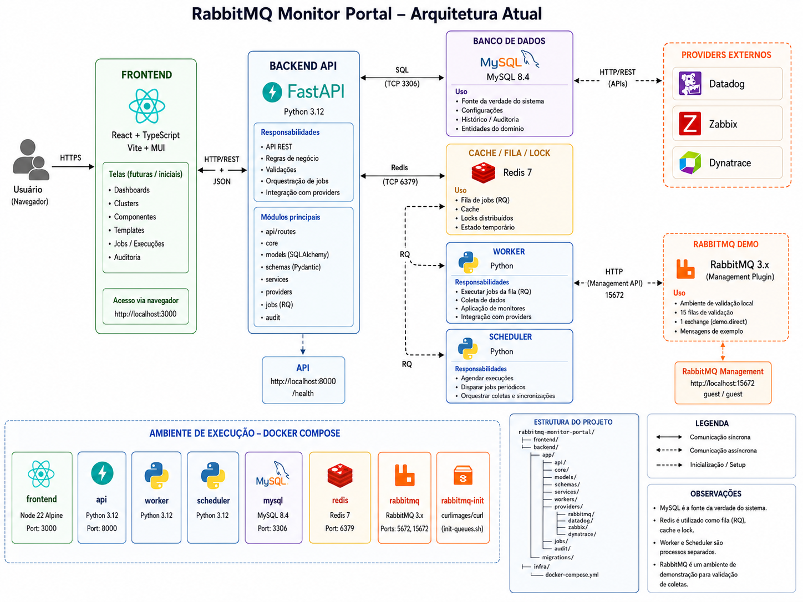

# RabbitMQ Monitor Portal

Portal web para gerenciamento de clusters RabbitMQ, discovery de filas, histórico operacional de jobs e governança de templates de monitoramento para ferramentas de observabilidade.

A aplicação mantém o **MySQL como fonte da verdade** das configurações, componentes descobertos e templates aplicados. O Redis é usado para filas de processamento, cache e suporte aos workers.

## Arquitetura



## Stack

- **Frontend:** React + TypeScript + Vite + MUI
- **Backend:** Python + FastAPI
- **Worker:** Python + RQ
- **Banco de dados:** MySQL 8.4
- **Cache/Fila:** Redis 7
- **Diretório local para desenvolvimento:** OpenLDAP
- **RabbitMQ de demonstração:** RabbitMQ Management
- **Orquestração local:** Docker Compose

## Serviços do Docker Compose

| Serviço | Descrição | Porta local |
|---|---|---:|
| `frontend` | Interface web React/Vite | `3000` |
| `api` | API FastAPI | `8000` |
| `worker` | Worker RQ para jobs assíncronos | - |
| `scheduler` | Atualização periódica do cache de diretório e enfileiramento recorrente de discovery | - |
| `mysql` | Banco MySQL 8.4 | `3306` |
| `redis` | Redis para cache/fila | `6379` |
| `ldap` | OpenLDAP local com usuários de exemplo | `389` |
| `rabbitmq` | RabbitMQ demo com Management | `5672`, `15672` |
| `rabbitmq-init` | Script de criação de filas demo | - |

## Pré-requisitos

- Docker
- Docker Compose
- Git

## Subir o ambiente local

```bash
cd infra
docker compose up --build
```

Acessos locais:

| Recurso | URL / acesso |
|---|---|
| Frontend | http://localhost:3000 |
| API | http://localhost:8000 |
| Documentação Swagger | http://localhost:8000/docs |
| RabbitMQ Management | http://localhost:15672 |
| RabbitMQ usuário | `guest` |
| RabbitMQ senha | `guest` |
| MySQL host local | `localhost:3306` |
| MySQL database | `rabbitmq_monitor_portal` |
| MySQL app user | `app` |
| MySQL app password | `app_password` |
| MySQL root password | `root_password` |

## Primeiro uso

Após subir os containers, acesse o frontend e siga este fluxo:

1. Acesse **Administração > Grupos SRE**.
2. Crie ou edite um grupo SRE.
3. Adicione pessoas ao grupo usando o autocomplete por e-mail.
4. Acesse **Administração > Datadog Orgs**.
5. Cadastre uma org Datadog com API URL, Org URL, API Key e APP Key.
6. Acesse **Clusters**.
7. Crie um cluster RabbitMQ.
8. O portal testa a conectividade com o RabbitMQ antes de salvar.
9. Após salvar, enfileire o discovery de queues.
10. Acompanhe a execução em **Administração > Jobs**.
11. Acesse **Queues** para visualizar, editar metadados, aplicar templates e customizar thresholds.

Para usar o RabbitMQ demo como cluster cadastrado no portal:

| Campo | Valor |
|---|---|
| Nome | `RabbitMQ Demo` |
| Ambiente | `dev` |
| DNS do cluster | `rabbitmq` |
| Protocolo | `http` |
| Porta da API | `15672` |
| Usuário | `guest` |
| Senha | `guest` |

## Banco de dados

O script inicial do banco está em:

```text
infra/mysql/init/001_schema.sql
```

Ele é executado automaticamente pelo container `mysql` apenas quando o volume do banco é criado pela primeira vez.

### Recriar banco do zero em ambiente local

> Este comando apaga os volumes locais do MySQL, Redis, RabbitMQ e LDAP.

```bash
cd infra
docker compose down -v
docker compose up --build
```

### Aplicar upgrade SQL em banco já existente

Caso já exista volume MySQL criado, os scripts em `infra/mysql/init` não serão executados novamente. Para aplicar o upgrade disponível:

```bash
cd infra
docker compose exec -T mysql mysql -uroot -proot_password rabbitmq_monitor_portal < mysql/upgrade/002_phase1_adjustments.sql
```

## Redis

Não é necessário criar nenhuma estrutura manual no Redis.

O Redis é usado para:

- fila de jobs RQ;
- cache de pessoas do diretório;
- controle auxiliar dos workers;
- enfileiramento dos jobs de discovery recorrente.

Principais chaves usadas:

```text
rq:queue:default
rq:job:<job_id>
rq:worker:<worker_id>
directory:people
directory:people:refreshed_at
```

## OpenLDAP local

O ambiente local possui um container OpenLDAP para simular um diretório corporativo.

Seed de pessoas:

```text
infra/ldap/bootstrap/50-people.ldif
```

O cache de pessoas é atualizado pelo `scheduler` em um intervalo próprio. O padrão local é 1 hora:

```env
DIRECTORY_CACHE_REFRESH_INTERVAL_SECONDS=3600
```

Esse intervalo é independente do discovery de clusters e pode ser alterado em `infra/.env` ou diretamente nas variáveis do serviço `scheduler` no `infra/docker-compose.yml`. Após alterar, reinicie o scheduler:

```bash
cd infra
docker compose up -d --force-recreate scheduler
```

Também pode ser atualizado manualmente via API:

```http
POST /directory/refresh-cache
```

Busca de pessoas para autocomplete:

```http
GET /directory/people?query=<email>&limit=5
```

A busca é case-insensitive e retorna até 5 resultados.

## Scheduler de discovery

A partir da v0.2.0, o discovery recorrente é enfileirado pelo container `scheduler` e executado pelo container `worker`.

Intervalos principais:

```env
DIRECTORY_CACHE_REFRESH_INTERVAL_SECONDS=3600
DISCOVERY_SCHEDULER_INTERVAL_SECONDS=300
REMOVED_QUEUE_CLEANUP_INTERVAL_SECONDS=86400
REMOVED_QUEUE_RETENTION_DAYS=60
```

Esses tempos são independentes:

- `DIRECTORY_CACHE_REFRESH_INTERVAL_SECONDS`: atualização do cache LDAP/AD no Redis.
- `DISCOVERY_SCHEDULER_INTERVAL_SECONDS`: enfileiramento recorrente de discovery dos clusters ativos.
- `REMOVED_QUEUE_CLEANUP_INTERVAL_SECONDS`: enfileiramento recorrente do expurgo físico de queues removidas.
- `REMOVED_QUEUE_RETENTION_DAYS`: idade mínima, em dias, para apagar fisicamente queues já marcadas como removidas.

Fluxo operacional:

```text
Scheduler ou ação manual no frontend
  -> Redis/RQ
  -> Worker
  -> RabbitMQ Management API
  -> MySQL
  -> job_history
  -> audit_logs
```

O scheduler evita criar jobs duplicados quando já existe um discovery `queued` ou `running` para o mesmo cluster.

A visão operacional fica em:

```text
Administração > Jobs
```

Nesta tela é possível:

- filtrar jobs por status;
- filtrar jobs por cluster;
- enfileirar discovery para todos os clusters ativos;
- enfileirar discovery para um cluster específico;
- visualizar detalhes técnicos de execução;
- ver contadores de filas criadas, atualizadas e removidas;
- reexecutar jobs;
- enfileirar cleanup físico de queues removidas.

## Cleanup de queues removidas

A partir da v0.2.1, queues que desapareceram do RabbitMQ continuam seguindo o fluxo em duas etapas:

1. O discovery marca a queue como removida no banco com `is_removed=true` e `removed_at`.
2. O cleanup físico apaga definitivamente queues removidas há mais de `REMOVED_QUEUE_RETENTION_DAYS`, cujo padrão é 60 dias.

O cleanup é enfileirado automaticamente pelo scheduler a cada `REMOVED_QUEUE_CLEANUP_INTERVAL_SECONDS`, cujo padrão é 86400 segundos, ou pode ser executado manualmente pela tela:

```text
Administração > Jobs > Limpar removidas
```

Também existe endpoint direto:

```http
POST /jobs/cleanup/removed-queues
```

## RabbitMQ demo

O ambiente local inclui um RabbitMQ com Management Plugin.

O script abaixo cria filas de exemplo no RabbitMQ demo:

```text
infra/rabbitmq/init-queues.sh
```

Para validar a marcação de uma queue como removida, use o script auxiliar:

```bash
./infra/rabbitmq/delete-queue.sh demo.orders.created /
```

Depois execute um discovery manual ou aguarde o scheduler. A fila deve aparecer apenas no filtro de removidas da tela de Queues.

Também existe um wrapper em:

```bash
./auxiliar_scripts/delete_rabbitmq_queue.sh demo.orders.created /
```

O discovery de queues usa:

```http
GET /api/queues/?enable_queue_totals=true&disable_stats=true
```

## Criptografia de credenciais

Credenciais RabbitMQ e Datadog são armazenadas criptografadas no banco.

A mesma `CREDENTIAL_ENCRYPTION_KEY` precisa estar disponível para `api`, `worker` e `scheduler`.

No Docker Compose local, o arquivo `infra/.env` já define uma chave de desenvolvimento e o `docker-compose.yml` injeta essa variável nos três containers. Se essa chave mudar depois de já existirem credenciais salvas no MySQL, será necessário recriar as credenciais ou restaurar a chave antiga.

Para uso real, gere e configure uma chave Fernet:

```bash
python -c "from cryptography.fernet import Fernet; print(Fernet.generate_key().decode())"
```

Depois defina no ambiente:

```bash
CREDENTIAL_ENCRYPTION_KEY=<sua_chave_fernet>
```

No Docker Compose local, configure em:

```text
infra/.env
```

E mantenha a mesma chave em todos os serviços que precisam criptografar ou descriptografar credenciais.

## Funcionalidades atuais

### Clusters RabbitMQ

- Cadastro, edição e visualização de clusters.
- Teste de conectividade antes de salvar.
- Credenciais criptografadas.
- Regex para filas temporárias.
- Associação com Grupo SRE.
- Associação com Datadog Org.
- Opções de monitoramento por tipo de componente.
- Enfileiramento manual de discovery de queues.

### Queues

- Discovery via API RabbitMQ.
- Criação automática de novas queues no banco.
- Atualização automática de dados técnicos.
- Marcação lógica de queues removidas.
- Visualização separada de queues removidas.
- Edição de metadados manuais.
- Autocomplete de owner/devs por e-mail.
- Aplicação de templates.
- Customização de configurações do template aplicado.
- Filtros por template aplicado e por templates customizados.

### Templates de monitoramento

Templates iniciais disponíveis:

| Code | Descrição |
|---|---|
| `queue_message_threshold` | Fila com quantidade de mensagens acima de threshold |
| `queue_dlq_threshold` | Fila DLQ com mensagens acima de threshold |
| `queue_messages_low_consumers` | Fila com mensagens e baixo número de consumidores |
| `queue_messages_growing` | Fila com mensagens crescentes |
| `queue_no_messages` | Fila sem mensagens |

A aplicação usa herança dinâmica:

```text
configuração efetiva = default_config atual do template + overrides locais da queue
```

Se o template padrão mudar, as queues herdam automaticamente os novos valores, exceto nos campos customizados localmente.

### Administração

- Grupos SRE.
- Pessoas por grupo SRE.
- Datadog Orgs.
- Validação de credenciais Datadog antes de salvar.
- Guardrail de deleção quando Grupo SRE ou Datadog Org estiver em uso por clusters ativos.
- Jobs de discovery dentro da subseção **Administração > Jobs**.

### Audit log

O portal registra alterações relevantes, incluindo:

- criação/edição/deleção de Grupo SRE;
- criação/edição/deleção de Datadog Org;
- criação/edição de cluster;
- discovery de queues;
- criação/atualização/marcação de remoção de queues;
- edição de metadados de queue;
- aplicação/customização/remoção de templates.

## Endpoints principais

### Health

```http
GET /health
```

### Administração

```http
GET    /admin/sre-groups
POST   /admin/sre-groups
PUT    /admin/sre-groups/{group_id}
DELETE /admin/sre-groups/{group_id}

GET    /admin/datadog-orgs
POST   /admin/datadog-orgs
PUT    /admin/datadog-orgs/{org_id}
DELETE /admin/datadog-orgs/{org_id}
```

### Diretório

```http
GET  /directory/people?query=<email>&limit=5
POST /directory/refresh-cache
```

### Clusters

```http
GET  /clusters
POST /clusters
GET  /clusters/{cluster_id}
PUT  /clusters/{cluster_id}
POST /clusters/{cluster_id}/test-connection
POST /clusters/{cluster_id}/discover-queues  # compatível: enfileira job
```

### Queues

```http
GET /components/queues
PUT /components/queues/{queue_id}

GET    /components/queues/{queue_id}/templates
POST   /components/queues/{queue_id}/templates
PUT    /components/queues/{queue_id}/templates/{binding_id}
DELETE /components/queues/{queue_id}/templates/{binding_id}
```

### Templates, jobs e auditoria

```http
GET  /templates

GET  /jobs
GET  /jobs/{job_id}
POST /jobs/discovery/cluster/{cluster_id}
POST /jobs/discovery/all
POST /jobs/{job_id}/retry

GET  /audit-logs
```

## Comandos úteis

### Ver logs

```bash
cd infra
docker compose logs -f api
docker compose logs -f frontend
docker compose logs -f worker
docker compose logs -f scheduler
```

### Reiniciar somente API

```bash
cd infra
docker compose restart api
```

### Rebuild completo

```bash
cd infra
docker compose up --build
```

### Entrar no MySQL

```bash
cd infra
docker compose exec mysql mysql -uapp -papp_password rabbitmq_monitor_portal
```

### Consultar Redis

```bash
cd infra
docker compose exec redis redis-cli
```

### Testar API localmente

```bash
curl http://localhost:8000/health
```

## Estrutura resumida

```text
rabbitmq-monitor-portal/
  backend/
    app/
      api/
      audit/
      core/
      jobs/
      models/
      providers/
      schemas/
      services/
      workers/
  frontend/
    src/
  infra/
    docker-compose.yml
    ldap/
    mysql/
    rabbitmq/
  docs/
  img/
```


## Edição em massa na v0.4.0

A versão `v0.4.0` adiciona a tela **Edição em massa**, usada para aplicar alterações em lote em queues e templates aplicados.

A tela permite filtrar queues por:

- cluster;
- texto livre;
- vhost;
- regex do nome da fila;
- criticidade;
- owner;
- serviço;
- template aplicado;
- somente templates customizados;
- filas ativas/removidas.

Antes de executar uma ação, o usuário carrega uma **prévia de impacto** com a quantidade de filas encontradas e uma amostra selecionável. Se nenhuma linha for selecionada, a ação usa todos os filtros; se houver linhas selecionadas, a ação é aplicada somente nelas.

Ações disponíveis:

- atualizar metadados operacionais da queue;
- aplicar template em massa;
- remover template em massa;
- customizar overrides de template em massa;
- limpar overrides para voltar à herança dinâmica;
- habilitar/desabilitar template aplicado em massa.

Todas as ações registram `audit_logs` com o resumo da operação, quantidade de filas encontradas, alteradas e ignoradas.

## Gestão de templates na v0.3.0

A versão `v0.3.0` adiciona a gestão completa dos templates de monitoramento na tela **Templates**.

Funcionalidades disponíveis:

```text
Criar templates de queue
Editar nome, descrição, monitor_kind, status e default_config
Visualizar templates em modo somente leitura
Desativar e reativar templates
Remover fisicamente templates customizados que não estejam em uso
Consultar onde cada template está aplicado
Ver total de aplicações, aplicações customizadas e aplicações herdadas
Ver prévia de impacto antes de alterar default_config
Registrar alterações em audit log
```

A herança continua dinâmica:

```text
configuração efetiva = default_config atual do template + overrides locais da queue
```

Isso significa que alterações no `default_config` do template impactam automaticamente as queues que não possuem override no campo alterado.

Observação importante: a rotina de seed inicial não sobrescreve mais templates já existentes no startup. Assim, alterações feitas pela interface permanecem após restart dos containers.


## Ajuste v0.4.1

A versão `v0.4.1` ajusta a ação **Atualizar metadados** da tela **Edição em massa** para usar o mesmo autocomplete de pessoas baseado no cache LDAP/Redis já usado na edição individual de queues.

Campos ajustados:

```text
Owner
Devs para notificação
```

A busca continua sendo feita por e-mail/nome, sem case sensitive, limitada a 5 opções retornadas pelo endpoint `/directory/people`.

## Roadmap planejado

Este roadmap será usado como referência para as próximas etapas do projeto.

| Versão | Objetivo |
|---|---|
| `v0.1.6` | MVP funcional da Fase 1 |
| `v0.1.7` | Correções finas, README, release e pequenos bugs visuais |
| `v0.2.0` | Discovery recorrente via scheduler/worker e tela **Administração > Jobs** |
| `v0.2.1` | Cleanup físico de queues removidas após 60 dias e script auxiliar de remoção de fila no RabbitMQ demo |
| `v0.3.0` | Gestão completa de templates |
| `v0.4.0` | Edição em massa de queues/templates |
| `v0.4.1` | Ajuste de autocomplete LDAP/Redis na edição em massa |
| `v0.5.0` | Datadog Planner / Dry-run e página pública de referência da queue |
| `v0.5.1` | Persistência do estado desejado em `generated_monitors` |
| `v0.5.2` | Criação/atualização real de monitores agrupados via API Datadog |
| `v0.5.3` | Sync incremental por org, template, cluster e monitor específico |
| `v0.5.4` | Desativação segura de monitores fora do escopo |
| `v0.6.x` | Manutenção/downtime via escopo por tag |
| `v0.7.x` | Monitores composite |
| `v1.0.0` | Primeira versão produtiva controlada |

## Próxima etapa sugerida

Após validar a `v0.5.2`, a próxima entrega natural é a `v0.5.3`, com sync incremental por org/template/cluster/monitor.

## Versão

Versão atual do pacote: **v0.5.2**.

## Integração Datadog — v0.5.0

A versão `v0.5.0` inicia a integração Datadog com **Planner / Dry-run**. Esta versão **não cria, atualiza ou remove monitores reais** no Datadog. O objetivo é validar o desenho dos monitores agrupados antes da etapa de aplicação via API.

### Decisões de arquitetura Datadog

- O portal continua sendo a fonte da verdade.
- Os monitores serão agrupados sempre que possível.
- Não serão adicionadas novas tags/cardinalidade no Datadog nesta etapa.
- As tags usadas no Datadog são as já existentes:

```text
rabbitmq_cluster
vhost
queue
```

- Informações como owner, criticidade, SREs, devs, serviço, jornada e descrição ficam no portal.
- A mensagem do alerta Datadog aponta para uma página pública do portal com o contexto completo da fila.

### Página pública de referência da queue

A página pública pode ser aberta sem autenticação:

```text
/public/queue-reference?rabbitmq_cluster=<cluster>&vhost=<vhost>&queue=<queue>
```

Essa rota deve continuar pública quando SAML/RBAC for implementado futuramente.

Ela exibe:

- cluster;
- ambiente;
- linha de negócio;
- vhost;
- queue;
- serviço;
- criticidade;
- owner;
- grupo SRE;
- membros do grupo SRE;
- devs;
- jornada;
- descrição;
- templates aplicados;
- configuração efetiva dos templates;
- overrides locais;
- status de remoção;
- último discovery.

### Datadog Sync

A nova tela fica em:

```text
Administração > Datadog Sync
```

Ela mostra um dry-run com:

- org Datadog;
- template;
- configuração efetiva;
- quantidade de queues cobertas;
- quantidade herdada/customizada;
- query Datadog renderizada;
- message template renderizado;
- tags/options;
- avisos e erros;
- amostra de queues incluídas no bucket.

### Campos Datadog nos templates

Cada template agora pode possuir:

```text
datadog_monitor_type
datadog_query_template
datadog_message_template
datadog_tags_template
datadog_options
```

Exemplo de query agrupada:

```text
max(last_{{window}}):max:rabbitmq.queue.messages{rabbitmq_cluster:*} by {rabbitmq_cluster,vhost,queue} > {{threshold}}
```

Exemplo de link público na mensagem:

```text
{{portal_public_base_url}}/public/queue-reference?rabbitmq_cluster={{rabbitmq_cluster.name}}&vhost={{vhost.name}}&queue={{queue.name}}
```

A URL base pública é configurada por:

```env
PORTAL_PUBLIC_BASE_URL=http://localhost:3000
```

Em produção, ajuste para a URL real do portal.

### Upgrade SQL v0.5.0

Se você já tem banco criado antes da v0.5.0, execute:

```bash
cd infra
docker compose exec -T mysql mysql -uroot -proot_password rabbitmq_monitor_portal < mysql/upgrade/004_v0_5_0_datadog_planner.sql
```

Depois reinicie os serviços:

```bash
docker compose up -d --build
```


## Integração Datadog — v0.5.1

A versão `v0.5.1` mantém o comportamento seguro da v0.5.0, sem criar monitores reais no Datadog, mas passa a persistir o estado desejado em `generated_monitors`.

Principais mudanças:

- botão **Salvar plano** em `Administração > Datadog Sync`;
- comparação entre dry-run atual e plano já salvo;
- estados `new`, `changed` e `unchanged` nos buckets do planner;
- tabela **Estado desejado salvo** na tela Datadog Sync;
- status iniciais `pending_create`, `pending_update`, `synced` e `orphaned`;
- hash `desired_config_hash` para detectar mudança de query, mensagem, tags, options e configuração efetiva;
- marcação como `orphaned` quando um monitor planejado anteriormente sai do escopo do novo plano;
- audit log quando o plano é persistido.

A página pública de referência da queue agora possui alternância entre tema claro e dark. O tema claro é o padrão, para facilitar uso por pessoas que abrirão a URL a partir de alertas.

### Upgrade SQL v0.5.1

Se você já tem banco criado antes da v0.5.1, execute:

```bash
cd infra
docker compose exec -T mysql mysql -uroot -proot_password rabbitmq_monitor_portal < mysql/upgrade/005_v0_5_1_generated_monitors.sql
```

Depois reinicie os serviços:

```bash
docker compose up -d --build
```

## Roadmap Datadog atualizado

### v0.5.x — Monitores agrupados e arcabouço Datadog

- `v0.5.0`: Datadog Planner / Dry-run + página pública de referência da queue.
- `v0.5.1`: persistência do estado desejado em `generated_monitors`.
- `v0.5.2`: criação/atualização real de monitores agrupados via API Datadog.
- `v0.5.3`: sync incremental por org, template, cluster e monitor específico.
- `v0.5.4`: desativação segura de monitores fora do escopo.

### v0.6.x — Manutenção / Downtime

- `v0.6.0`: calendários internos de monitoramento.
- `v0.6.1`: planner de downtimes por tag/scope.
- `v0.6.2`: criação/atualização real de downtimes via API Datadog.
- `v0.6.3`: associação entre downtime, calendário e monitores gerados.

### v0.7.x — Composite monitors

- `v0.7.0`: modelagem de templates compostos.
- `v0.7.1`: planner de composite.
- `v0.7.2`: criação de monitores base muted/no notification.
- `v0.7.3`: criação real dos composite monitors.

Versão atual do pacote: **v0.5.2**.


## Integração Datadog — v0.5.2

A versão `v0.5.2` aplica o estado desejado salvo em `generated_monitors` criando ou atualizando monitores agrupados reais no Datadog via API.

Fluxo operacional:

1. Gerar dry-run em `Administração > Datadog Sync`.
2. Salvar plano.
3. Clicar em `Aplicar no Datadog`.
4. Acompanhar o job `datadog_sync_monitors` em `Administração > Jobs`.

Guardrails desta versão:

- Só aplica monitores com status `pending_create`, `pending_update` ou `error`.
- Ignora `orphaned` e `disabled`.
- Não deleta, não muta e não renomeia monitores fora de escopo.
- Não aplica se query, message ou credenciais Datadog estiverem ausentes.
- Usa API Datadog v1 de Monitors para `POST /api/v1/monitor` e `PUT /api/v1/monitor/{monitor_id}`.

O resultado do job atualiza:

- `external_monitor_id`
- `external_monitor_url`
- `applied_config_hash`
- `last_synced_at`
- `sync_status`
- `last_error`, quando houver falha

Não há upgrade SQL novo entre `v0.5.1` e `v0.5.2`.
